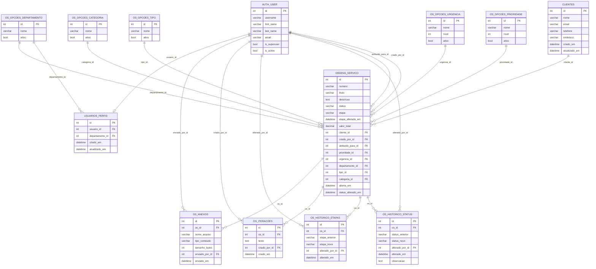

# Diagrama do Banco de Dados — SGOS

Diagrama ER simplificado baseado nas tabelas do backend.

```mermaid
erDiagram
  AUTH_USER {
    int id PK
    varchar username
    varchar first_name
    varchar last_name
    varchar email
    bool is_superuser
    bool is_active
  }

  USUARIOS_PERFIS {
    int id PK
    int usuario_id FK
    int departamento_id FK
    datetime criado_em
    datetime atualizado_em
  }

  CLIENTES {
    int id PK
    varchar nome
    varchar email
    varchar telefone
    varchar endereco
    datetime criado_em
    datetime atualizado_em
  }

  ORDENS_SERVICO {
    int id PK
    varchar numero
    varchar titulo
    text descricao
    varchar status
    varchar etapa
    datetime etapa_alterada_em
    decimal valor_total
    int cliente_id FK
    int criado_por_id FK
    int atribuido_para_id FK
    int prioridade_id FK
    int urgencia_id FK
    int departamento_id FK
    int tipo_id FK
    int categoria_id FK
    datetime aberta_em
    datetime status_alterado_em
  }

  OS_HISTORICO_STATUS {
    int id PK
    int os_id FK
    varchar status_anterior
    varchar status_novo
    int alterado_por_id FK
    datetime alterado_em
    text observacao
  }

  OS_HISTORICO_ETAPAS {
    int id PK
    int os_id FK
    varchar etapa_anterior
    varchar etapa_nova
    int alterado_por_id FK
    datetime alterado_em
  }

  OS_ITERACOES {
    int id PK
    int os_id FK
    text texto
    int criado_por_id FK
    datetime criado_em
  }

  OS_ANEXOS {
    int id PK
    int os_id FK
    varchar nome_arquivo
    varchar tipo_conteudo
    int tamanho_bytes
    int enviado_por_id FK
    datetime enviado_em
  }

  OS_OPCOES_DEPARTAMENTO {
    int id PK
    varchar nome
    bool ativo
  }

  OS_OPCOES_PRIORIDADE {
    int id PK
    varchar nome
    int nivel
    bool ativo
  }

  OS_OPCOES_URGENCIA {
    int id PK
    varchar nome
    int nivel
    bool ativo
  }

  OS_OPCOES_TIPO {
    int id PK
    varchar nome
    bool ativo
  }

  OS_OPCOES_CATEGORIA {
    int id PK
    varchar nome
    bool ativo
  }

  CLIENTES ||--o{ ORDENS_SERVICO : "cliente_id"
  AUTH_USER ||--o{ ORDENS_SERVICO : "criado_por_id"
  AUTH_USER ||--o{ ORDENS_SERVICO : "atribuido_para_id"

  ORDENS_SERVICO ||--o{ OS_HISTORICO_STATUS : "os_id"
  ORDENS_SERVICO ||--o{ OS_HISTORICO_ETAPAS : "os_id"
  ORDENS_SERVICO ||--o{ OS_ITERACOES : "os_id"
  ORDENS_SERVICO ||--o{ OS_ANEXOS : "os_id"

  AUTH_USER ||--o{ OS_HISTORICO_STATUS : "alterado_por_id"
  AUTH_USER ||--o{ OS_HISTORICO_ETAPAS : "alterado_por_id"
  AUTH_USER ||--o{ OS_ITERACOES : "criado_por_id"
  AUTH_USER ||--o{ OS_ANEXOS : "enviado_por_id"

  AUTH_USER ||--o| USUARIOS_PERFIS : "usuario_id"
  OS_OPCOES_DEPARTAMENTO ||--o{ USUARIOS_PERFIS : "departamento_id"

  OS_OPCOES_PRIORIDADE ||--o{ ORDENS_SERVICO : "prioridade_id"
  OS_OPCOES_URGENCIA ||--o{ ORDENS_SERVICO : "urgencia_id"
  OS_OPCOES_DEPARTAMENTO ||--o{ ORDENS_SERVICO : "departamento_id"
  OS_OPCOES_TIPO ||--o{ ORDENS_SERVICO : "tipo_id"
  OS_OPCOES_CATEGORIA ||--o{ ORDENS_SERVICO : "categoria_id"
```

