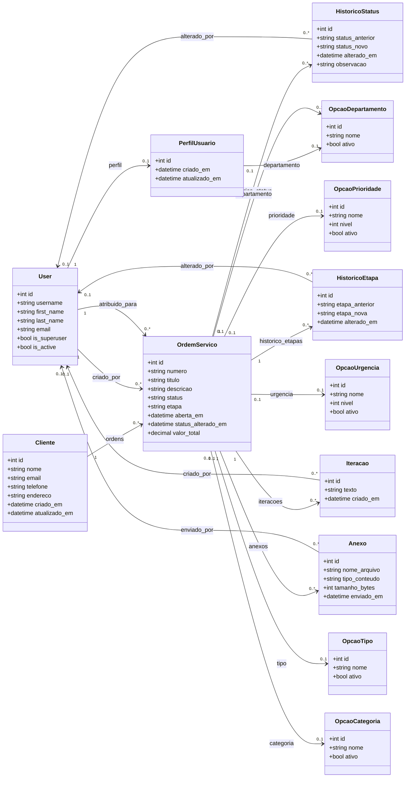

# Diagrama de Classe — SGOS

```mermaid
classDiagram
direction LR

class User {
  +int id
  +string username
  +string first_name
  +string last_name
  +string email
  +bool is_superuser
  +bool is_active
}

class PerfilUsuario {
  +int id
  +datetime criado_em
  +datetime atualizado_em
}

class Cliente {
  +int id
  +string nome
  +string email
  +string telefone
  +string endereco
  +datetime criado_em
  +datetime atualizado_em
}

class OrdemServico {
  +int id
  +string numero
  +string titulo
  +string descricao
  +string status
  +string etapa
  +datetime aberta_em
  +datetime status_alterado_em
  +decimal valor_total
}

class HistoricoStatus {
  +int id
  +string status_anterior
  +string status_novo
  +datetime alterado_em
  +string observacao
}

class HistoricoEtapa {
  +int id
  +string etapa_anterior
  +string etapa_nova
  +datetime alterado_em
}

class Iteracao {
  +int id
  +string texto
  +datetime criado_em
}

class Anexo {
  +int id
  +string nome_arquivo
  +string tipo_conteudo
  +int tamanho_bytes
  +datetime enviado_em
}

class OpcaoDepartamento {
  +int id
  +string nome
  +bool ativo
}
class OpcaoPrioridade {
  +int id
  +string nome
  +int nivel
  +bool ativo
}
class OpcaoUrgencia {
  +int id
  +string nome
  +int nivel
  +bool ativo
}
class OpcaoTipo {
  +int id
  +string nome
  +bool ativo
}
class OpcaoCategoria {
  +int id
  +string nome
  +bool ativo
}

User "1" --> "0..1" PerfilUsuario : perfil
PerfilUsuario "0..1" --> "0..1" OpcaoDepartamento : departamento

Cliente "1" --> "0..*" OrdemServico : ordens
User "1" --> "0..*" OrdemServico : criado_por
User "1" --> "0..*" OrdemServico : atribuido_para

OrdemServico "1" --> "0..*" HistoricoStatus : historico_status
OrdemServico "1" --> "0..*" HistoricoEtapa : historico_etapas
OrdemServico "1" --> "0..*" Iteracao : iteracoes
OrdemServico "1" --> "0..*" Anexo : anexos

HistoricoStatus "0..*" --> "0..1" User : alterado_por
HistoricoEtapa "0..*" --> "0..1" User : alterado_por
Iteracao "0..*" --> "0..1" User : criado_por
Anexo "0..*" --> "0..1" User : enviado_por

OrdemServico "0..1" --> "0..1" OpcaoPrioridade : prioridade
OrdemServico "0..1" --> "0..1" OpcaoUrgencia : urgencia
OrdemServico "0..1" --> "0..1" OpcaoDepartamento : departamento
OrdemServico "0..1" --> "0..1" OpcaoTipo : tipo
OrdemServico "0..1" --> "0..1" OpcaoCategoria : categoria
```

